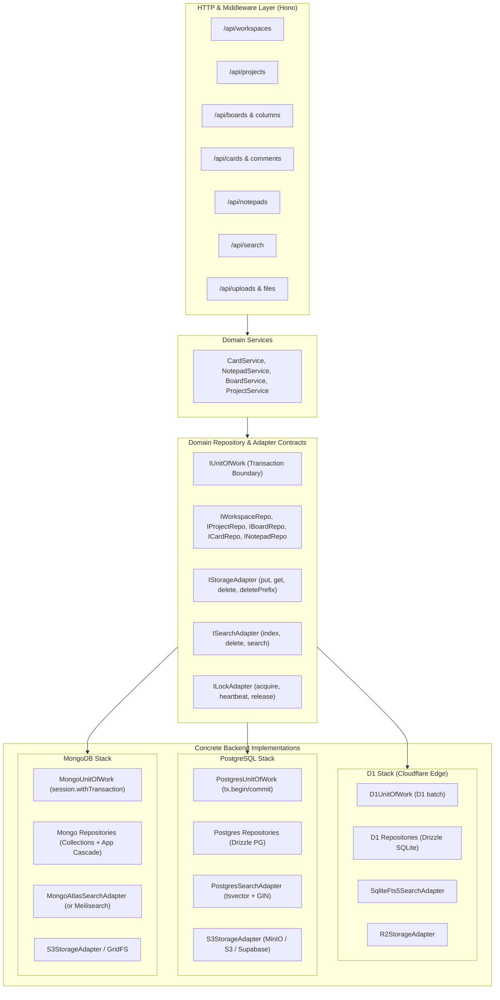

# Multi-Engine Persistence & System Adapter Plan (Postgres, MongoDB, D1)

This document specifies the architecture, interface contracts, implementation roadmap, and checklists for supporting **PostgreSQL**, **MongoDB**, and **Cloudflare D1** as interchangeable persistence backends in Burrow.

---

## 1. Engine Parity Matrix

The table below contrasts how Burrow's core primitives map across the three target databases:

| Feature / Requirement | Cloudflare D1 (Current) | PostgreSQL | MongoDB |
| :--- | :--- | :--- | :--- |
| **Driver / Library** | `@cloudflare/workers-types` + `drizzle-orm/d1` | `postgres` (or `@neondatabase/serverless`) + `drizzle-orm/node-postgres` (or `pg-core`) | Official `mongodb` driver (or `mongoose`) |
| **Atomic Transactions** | Native `db.$client.batch()` ([batch.ts](file:///d:/Burrow/src/worker/lib/batch.ts)) | Native `db.transaction(async (tx) => ...)` | Client Session `session.withTransaction(...)` |
| **Cascade Deletes** | Foreign keys with `ON DELETE CASCADE` | Foreign keys with `ON DELETE CASCADE` | Application-level cascade engine (`deleteCascade`) |
| **Notepad Tree Hierarchy** | In-memory reconstruction via [tree.ts](file:///d:/Burrow/src/worker/lib/tree.ts) | Recursive CTE (`WITH RECURSIVE`) or `ltree` | Materialized Path array (`path: [ancestorIds]`) |
| **Full-Text Search** | SQLite FTS5 virtual table (`notepads_fts`) | `tsvector` + GIN index + `ts_rank_cd` + `ts_headline` | MongoDB Atlas Search (`$search`) or text index (`$text`) |
| **Fractional Ordering** | String column (`position`) sorted with `asc()` | String column (`position`) sorted with `asc()` | String field (`position`) sorted with `{ position: 1 }` |
| **Auth Adapter** | Better Auth `drizzleAdapter(db, { provider: 'sqlite' })` | Better Auth `drizzleAdapter(pgDb, { provider: 'pg' })` | Better Auth `mongodbAdapter(db)` |
| **Deployment Targets** | Cloudflare Workers | Cloudflare Workers (Hyperdrive/Neon), Node.js, Docker | Node.js, Docker, Cloud Run, Serverless |

---

## 2. Architecture Overview



---

## 3. Auxiliary Subsystem Adapters (Pre-Requisites)

Before touching database queries, the 4 side-car systems coupled to Cloudflare/SQLite must be abstracted:

### 3.1 Object Storage Adapter (`IStorageAdapter`)
* **Current**: Hardcoded to `c.env.FILES` in [files.ts](file:///d:/Burrow/src/worker/routes/files.ts) and [projects.ts](file:///d:/Burrow/src/worker/services/projects.ts).
* **Interface**:
  ```ts
  export interface StorageObject {
    body: ReadableStream | ArrayBuffer
    contentType?: string
    contentLength?: number
  }

  export interface IStorageAdapter {
    put(key: string, data: ArrayBuffer | Uint8Array, contentType?: string): Promise<void>
    get(key: string): Promise<StorageObject | null>
    delete(key: string): Promise<void>
    deletePrefix(prefix: string): Promise<void>
  }
  ```
* **Implementations**:
  1. `R2StorageAdapter` (Cloudflare R2 binding)
  2. `S3StorageAdapter` (AWS S3, MinIO, Supabase Storage)
  3. `LocalStorageAdapter` (Node.js filesystem for standalone local testing)

### 3.2 Full-Text Search Adapter (`ISearchAdapter`)
* **Current**: Direct raw SQL queries on SQLite `notepads_fts` in [search.ts](file:///d:/Burrow/src/worker/lib/search.ts) and [search.ts](file:///d:/Burrow/src/worker/routes/search.ts).
* **Interface**:
  ```ts
  export interface SearchDocument {
    id: string
    workspaceId: string
    projectId: string
    kind: 'notepad' | 'card'
    title: string
    body: string
  }

  export interface SearchQuery {
    workspaceId: string
    projectId?: string
    text: string
    limit?: number
  }

  export interface SearchHit {
    id: string
    title: string
    icon?: string | null
    kind: 'notepad' | 'card'
    projectId: string
    projectName: string
    snippet: string
  }

  export interface ISearchAdapter {
    indexDocument(doc: SearchDocument): Promise<void>
    deleteDocument(id: string): Promise<void>
    deleteByProject(projectId: string): Promise<void>
    search(query: SearchQuery): Promise<SearchHit[]>
  }
  ```
* **Implementations**:
  1. `SqliteFts5SearchAdapter`: Uses virtual table `notepads_fts` with `snippet()` and `MATCH`.
  2. `PostgresSearchAdapter`: Uses `tsvector` column + GIN index, `websearch_to_tsquery()`, and `ts_headline()`.
  3. `MongoSearchAdapter`: Uses Atlas Search `$search` or `$text` index with `$meta: "textScore"`.

### 3.3 Soft Concurrency Lock Adapter (`ILockAdapter`)
* **Current**: `edit_locks` SQLite table in [schema.ts](file:///d:/Burrow/src/worker/db/schema.ts#L350).
* **Interface**:
  ```ts
  export interface LockResult {
    acquired: boolean
    holderUserId?: string
    expiresAt?: number
  }

  export interface ILockAdapter {
    acquire(resourceId: string, userId: string, clientId: string, ttlMs: number): Promise<LockResult>
    heartbeat(resourceId: string, clientId: string, ttlMs: number): Promise<boolean>
    release(resourceId: string, clientId: string): Promise<void>
  }
  ```
* **Implementations**:
  1. `SqlLockAdapter`: Generic SQL table upsert with expiration comparison (works on both D1 and Postgres).
  2. `MongoLockAdapter`: Atomic `findOneAndUpdate` with TTL / expiration checks.
  3. `RedisLockAdapter` (optional for distributed high-concurrency setups).

### 3.4 Authentication Adapter (`IAuthAdapter`)
* **Current**: Better Auth in [auth.ts](file:///d:/Burrow/src/worker/auth.ts).
* **Strategy**:
  * For D1: `drizzleAdapter(db, { provider: 'sqlite', schema })`
  * For Postgres: `drizzleAdapter(pgDb, { provider: 'pg', schema })`
  * For MongoDB: `@better-auth/mongo-adapter` with native collection handles.

---

## 4. Repository & Unit of Work Contracts

### 4.1 Unit of Work (`IUnitOfWork`)
Manages transaction atomicity across different drivers:
```ts
export interface ITransactionContext {
  workspaces: IWorkspaceRepository
  projects: IProjectRepository
  boards: IBoardRepository
  cards: ICardRepository
  notepads: INotepadRepository
  tags: ITagRepository
  notifications: INotificationRepository
}

export interface IUnitOfWork {
  runInTransaction<T>(work: (ctx: ITransactionContext) => Promise<T>): Promise<T>
  getContext(): ITransactionContext
}
```

### 4.2 Core Repository Interfaces
- **`IWorkspaceRepository`**: `findById`, `create`, `listMembers`, `addMember`, `removeMember`, `findInviteByHash`, `createInvite`, `acceptInvite`.
- **`IProjectRepository`**: `listByWorkspace`, `findById`, `create`, `update`, `reorder`, `permanentDeleteCascade`.
- **`IBoardRepository`**: `listByProject`, `findById`, `create`, `update`, `addColumn`, `updateColumn`, `deleteColumn`, `permanentDeleteBoardCascade`.
- **`ICardRepository`**: `createWithNotepad`, `getById`, `updateCard`, `moveCard`, `setAssignees`, `addSubtask`, `toggleSubtask`, `addComment`, `listComments`.
- **`INotepadRepository`**: `getTreeByProject`, `getById`, `saveContent` (with optimistic version lock), `moveNotepad`, `softDelete`, `permanentDeleteCascade`, `syncLinks`.
- **`ITagRepository`**: `listByProject`, `create`, `delete`, `setCardTags`.
- **`INotificationRepository`**: `listByUser`, `markAsRead`, `createMany`.

---

## 5. Detailed Implementation Checklists

### Phase 0: Pre-Requisite Subsystems Decoupling
Isolate side-cars before touching any database queries.

- [ ] **Storage Decoupling**:
  - [ ] Create `src/worker/core/adapters/storage.ts` with `IStorageAdapter`.
  - [ ] Implement `R2StorageAdapter` in `src/worker/adapters/storage/r2.ts`.
  - [ ] Implement `S3StorageAdapter` in `src/worker/adapters/storage/s3.ts`.
  - [ ] Refactor [files.ts](file:///d:/Burrow/src/worker/routes/files.ts) to resolve storage via adapter.
  - [ ] Refactor [projects.ts](file:///d:/Burrow/src/worker/services/projects.ts) cover/file cleanup to use `storage.deletePrefix()`.
- [ ] **Search Decoupling**:
  - [ ] Create `src/worker/core/adapters/search.ts` with `ISearchAdapter`.
  - [ ] Implement `SqliteFts5SearchAdapter` in `src/worker/adapters/search/sqlite-fts.ts` wrapping [lib/search.ts](file:///d:/Burrow/src/worker/lib/search.ts).
  - [ ] Refactor [search.ts](file:///d:/Burrow/src/worker/routes/search.ts) route handler to call `searchAdapter.search()`.
  - [ ] Decouple [cards.ts](file:///d:/Burrow/src/worker/services/cards.ts) and [notepads.ts](file:///d:/Burrow/src/worker/services/notepads.ts) from `notepads_fts` raw SQL statements.
- [ ] **Soft Lock Decoupling**:
  - [ ] Create `src/worker/core/adapters/lock.ts` with `ILockAdapter`.
  - [ ] Implement `SqlLockAdapter` in `src/worker/adapters/lock/sql-lock.ts`.
  - [ ] Refactor [routes/notepads.ts](file:///d:/Burrow/src/worker/routes/notepads.ts) lock endpoints to consume `ILockAdapter`.

---

### Phase 1: Core Domain Contracts & Pure Entities
Define pure interfaces decoupled from ORMs and drivers.

- [ ] **Domain Entity Types** in `src/worker/core/entities/`:
  - [ ] `Workspace`, `Member`, `Invite`
  - [ ] `Project`
  - [ ] `Board`, `BoardColumn`
  - [ ] `Card`, `CardAssignee`, `CardSubtask`, `CardComment`
  - [ ] `Notepad`, `NotepadLink`, `NotepadTag`
  - [ ] `Notification`
- [ ] **Repository Interfaces** in `src/worker/core/repositories/`:
  - [ ] `workspace.ts`, `project.ts`, `board.ts`, `card.ts`, `notepad.ts`, `tag.ts`, `notification.ts`
  - [ ] `uow.ts` (`IUnitOfWork`, `ITransactionContext`)

---

### Phase 2: Cloudflare D1 Reference Implementation (Zero Regressions)
Package current Drizzle SQLite queries into repository implementations to verify pure backwards compatibility.

- [ ] **D1 Repositories** in `src/worker/adapters/db/d1/`:
  - [ ] `D1UnitOfWork` (encapsulating [runBatch()](file:///d:/Burrow/src/worker/lib/batch.ts))
  - [ ] `D1WorkspaceRepository`
  - [ ] `D1ProjectRepository`
  - [ ] `D1BoardRepository`
  - [ ] `D1CardRepository` (preserves atomic card + notepad creation)
  - [ ] `D1NotepadRepository` (preserves version checking & tree queries)
  - [ ] `D1TagRepository` & `D1NotificationRepository`
- [ ] **Service Refactoring**:
  - [ ] Refactor [cards.ts](file:///d:/Burrow/src/worker/services/cards.ts) to accept repository interfaces instead of `db: DB`.
  - [ ] Refactor [notepads.ts](file:///d:/Burrow/src/worker/services/notepads.ts) to accept repository interfaces.
  - [ ] Refactor [projects.ts](file:///d:/Burrow/src/worker/services/projects.ts) and [boards.ts](file:///d:/Burrow/src/worker/services/boards.ts).
- [ ] **Hono Context Wiring**:
  - [ ] Create `createD1Container(env)` in `src/worker/container.ts`.
  - [ ] Mount repositories in Hono request context via middleware.
  - [ ] Execute `pnpm test` and `pnpm check` to ensure 100% parity with zero regressions.

---

### Phase 3: PostgreSQL Implementation
Full enterprise relational implementation.

- [ ] **Postgres Schema & Migrations**:
  - [ ] Define PostgreSQL schema in `src/worker/adapters/db/postgres/schema.ts` (`drizzle-orm/pg-core`).
  - [ ] Setup `drizzle.postgres.config.ts` for migration generation.
  - [ ] Configure relational `ON DELETE CASCADE` across all child tables.
- [ ] **Postgres Repositories** in `src/worker/adapters/db/postgres/`:
  - [ ] `PostgresUnitOfWork` utilizing native `db.transaction(async (tx) => ...)`.
  - [ ] `PostgresWorkspaceRepository`, `PostgresProjectRepository`, `PostgresBoardRepository`.
  - [ ] `PostgresCardRepository` and `PostgresNotepadRepository`.
  - [ ] Implement recursive CTE query for deep notepad tree resolution.
- [ ] **Postgres Search Adapter**:
  - [ ] Create `src/worker/adapters/search/postgres-fts.ts`.
  - [ ] Add `tsvector` generated column + GIN index on `notepads` (`title` + `plain_text`).
  - [ ] Use `ts_headline()` and `ts_rank_cd()` to match Burrow's snippet & ranking format.
- [ ] **Postgres Auth Setup**:
  - [ ] Configure Better Auth with `drizzleAdapter(pgDb, { provider: 'pg', schema })`.

---

### Phase 4: MongoDB Implementation
Document-based distributed storage implementation.

- [ ] **Collection Schema & Indices** in `src/worker/adapters/db/mongodb/`:
  - [ ] `workspaces`: `{ _id, name, createdBy, members: [...], createdAt }`
  - [ ] `projects`: `{ _id, workspaceId, name, icon, color, position, archivedAt, createdAt }`
  - [ ] `boards`: `{ _id, workspaceId, projectId, name, columns: [{ id, name, color, position, wipLimit }] }`
  - [ ] `cards`: `{ _id, workspaceId, boardId, columnId, notepadId, position, priority, dueDate, assignees: [...], subtasks: [...], comments: [...] }`
  - [ ] `notepads`: `{ _id, workspaceId, projectId, parentId, path: [ancestorIds], kind, title, content, version, position, isFavorite, deletedAt }`
  - [ ] Create unique and compound indexes (`{ workspaceId: 1, position: 1 }`, `{ projectId: 1, path: 1 }`).
- [ ] **Application Cascade Deletion Engine**:
  - [ ] Implement `MongoCascadeService` to replace missing relational foreign keys:
    - On delete workspace -> delete all projects, boards, cards, notepads, tags.
    - On delete project -> delete boards, columns, cards, notepads.
    - On delete board -> delete all associated cards and their underlying `card` notepads.
- [ ] **Hierarchical Tree Queries**:
  - [ ] Maintain `path: string[]` (ancestor IDs) on `notepads` on create/move.
  - [ ] Subtree query: `db.notepads.find({ path: notepadId })` for instant O(1) descendants lookup.
- [ ] **Mongo Unit of Work & Repositories**:
  - [ ] Implement `MongoUnitOfWork` using Client Sessions (`session.withTransaction`).
  - [ ] Implement `MongoCardRepository`, `MongoNotepadRepository`, `MongoBoardRepository`.
- [ ] **Mongo Search Adapter**:
  - [ ] Implement `MongoAtlasSearchAdapter` using `$search` (or fallback `$text` compound index).
- [ ] **Mongo Auth Setup**:
  - [ ] Configure Better Auth using `@better-auth/mongo-adapter`.

---

### Phase 5: Container Factory, Dynamic Switching & Local Dev

- [ ] **Environment Configuration**:
  - [ ] Update [env.ts](file:///d:/Burrow/src/worker/env.ts) to parse:
    - `DATA_BACKEND`: `'d1' | 'postgres' | 'mongodb'`
    - `POSTGRES_URL`: string (optional)
    - `MONGODB_URI`: string (optional)
    - `STORAGE_BACKEND`: `'r2' | 's3' | 'local'`
    - `SEARCH_BACKEND`: `'sqlite_fts' | 'postgres_fts' | 'mongo_search'`
- [ ] **App DI Container**:
  - [ ] Implement `createContainer(env)` in `src/worker/container.ts` that initializes the correct stack based on `DATA_BACKEND`.
- [ ] **Local Multi-Engine Dev Tooling**:
  - [ ] Create `docker-compose.yml` with:
    - PostgreSQL 16 (port 5432)
    - MongoDB 7.0 (port 27017)
    - MinIO (port 9000/9001 for S3 emulation)
  - [ ] Add `pnpm` scripts in [package.json](file:///d:/Burrow/package.json):
    - `"dev:d1"`: Current Wrangler D1 dev runner
    - `"dev:pg"`: Node/Wrangler with Postgres backend
    - `"dev:mongo"`: Node/Wrangler with MongoDB backend
- [ ] **Cross-Engine Migration CLI**:
  - [ ] Create `scripts/migrate-engine.mjs` allowing exporting data from D1 and seeding it into Postgres or MongoDB.
