# Burrow Feature Roadmap & Implementation Plan

This plan outlines the architecture, data models, UI specifications, and detailed implementation checklists for the next generation of features in Burrow. It bridges **Linear-grade task management** and **Notion-grade documentation** within Burrow's unified schema (where cards are rich-text notepads).

---

## Architecture Overview & Touchpoints

```mermaid
graph TD
    subgraph UI ["Frontend (React 19 + TanStack Router & Query)"]
        Sidebar["App Sidebar & Nav"]
        MyTasks["My Tasks View (New)"]
        Board["BoardView (Kanban, List, Calendar)"]
        Card["CardPanel + Subtasks & Comments"]
        Editor["NotepadEditor (BlockNote + TOC + Templates)"]
    end

    subgraph API ["Worker API (Hono + Better Auth)"]
        MyTasksAPI["/api/my-tasks"]
        CardsAPI["/api/cards & comments"]
        BoardAPI["/api/boards & columns"]
        NotepadsAPI["/api/notepads & templates"]
    end

    subgraph DB ["Cloudflare D1 (SQLite + Drizzle)"]
        cards["cards & card_assignees"]
        notepads["notepads & notepad_links"]
        comments["card_comments (New)"]
        subtasks["card_subtasks (New)"]
    end

    Sidebar --> MyTasks
    Board --> Card
    Card --> Editor
    MyTasks --> CardsAPI
    Board --> BoardAPI
    Card --> CardsAPI
    Editor --> NotepadsAPI
    CardsAPI --> cards
    CardsAPI --> comments
    CardsAPI --> subtasks
    NotepadsAPI --> notepads
```



---

## Epic 1: Personal Productivity & Cross-Project Workflow ("My Tasks")

### Problem & Rationale
Currently, users must navigate into individual projects and boards to check tasks assigned to them. A global **"My Tasks"** dashboard provides a unified inbox for personal priorities across all boards and projects.

### Key Components & Files
* **Route**: `/my-tasks` in `src/web/router.tsx`
* **View**: `src/web/pages/MyTasksView.tsx`
* **Nav Entry**: `src/web/components/layout/Sidebar.tsx` (pinned above Projects)
* **Backend Endpoint**: `GET /api/my-tasks` in `src/worker/routes/cards.ts`

### Implementation Checklist
- [ ] **Backend API (`GET /api/my-tasks`)**:
  - [ ] Query all cards where `card_assignees.userId == currentUser.id` joined with `boards`, `projects`, `board_columns`, and `notepads`.
  - [ ] Support filter parameters: `status` (`all` | `open` | `completed`), `projectId` (optional filter).
  - [ ] Return card details: `id`, `title`, `dueDate`, `priority`, `columnName`, `boardName`, `projectName`, `tags`.
- [ ] **Frontend Query Hook**:
  - [ ] Add `useMyTasks(filters)` in `src/web/lib/queries.ts`.
- [ ] **UI Page (`MyTasksView.tsx`)**:
  - [ ] Create grouped sections:
    - 🔴 **Overdue** (due date < today, not in completed column)
    - 🟡 **Due Today** (due date within today)
    - 🟢 **Upcoming / This Week** (due date within next 7 days)
    - ⚪ **Later & No Due Date**
  - [ ] Display project badges, priority pills, and due date indicators on each task row.
  - [ ] Provide quick inline actions: click to open `CardPanel`, complete task checkbox, snooze due date.
- [ ] **Navigation & Badge**:
  - [ ] Add "My Tasks" item in `Sidebar.tsx` with a badge showing overdue/today count.

---

## Epic 2: Board & Task Management Superpowers (Linear-Grade)

### 2.1 Subtasks / Checklists with Card Tile Progress Bar
### Problem & Rationale
Complex cards need actionable checklist items without forcing the user to read through the entire notepad document. Showing a `3/5` progress ring or bar on the board tile gives instant sprint visibility.

### Key Components & Files
* **Schema**: `src/worker/db/schema.ts` -> table `cardSubtasks`
* **Board Card Component**: `CardTile` in `src/web/components/boards/BoardView.tsx`
* **Card Details Component**: `src/web/components/boards/CardPanel.tsx`

### Implementation Checklist
- [ ] **Database & Migrations**:
  - [ ] Define `cardSubtasks` table:
    ```typescript
    export const cardSubtasks = sqliteTable('card_subtasks', {
      id: text('id').primaryKey(),
      cardId: text('card_id').notNull().references(() => cards.id, { onDelete: 'cascade' }),
      title: text('title').notNull(),
      completed: integer('completed', { mode: 'boolean' }).notNull().default(false),
      position: text('position').notNull(),
      createdAt: integer('created_at').notNull(),
    })
    ```
  - [ ] Generate Drizzle migration and apply locally (`pnpm db:migrate:local`).
- [ ] **Backend Endpoints**:
  - [ ] `POST /api/cards/:cardId/subtasks` (create subtask)
  - [ ] `PATCH /api/cards/:cardId/subtasks/:subtaskId` (toggle completed / rename)
  - [ ] `DELETE /api/cards/:cardId/subtasks/:subtaskId` (remove subtask)
  - [ ] Update `GET /api/boards/:boardId` to include subtask counts (`totalSubtasks`, `completedSubtasks`).
- [ ] **UI Implementation**:
  - [ ] In `CardPanel.tsx`, add a "Subtasks" section with an input to add items, reorder handles, and checkboxes.
  - [ ] In `BoardView.tsx`, add a subtask progress indicator on `CardTile` (e.g. `CheckSquare` icon + `2/4` pill or a mini progress bar if subtasks exist).

---

### 2.2 Multi-View Boards (Kanban | List | Calendar)
### Problem & Rationale
Some workflows (sprint triage, roadmap planning, release planning) are much faster in a compact table/list or date-oriented calendar grid than horizontal scrolling columns.

### Key Components & Files
* **Board View**: `src/web/components/boards/BoardView.tsx`
* **Sub-views**:
  * `src/web/components/boards/views/KanbanView.tsx` (extracted current layout)
  * `src/web/components/boards/views/ListView.tsx` (compact tabular rows grouped by column/status)
  * `src/web/components/boards/views/CalendarView.tsx` (monthly/weekly grid placing cards by `dueDate`)

### Implementation Checklist
- [ ] **View Switcher Header**:
  - [ ] Add view toggle pills (`Kanban`, `List`, `Calendar`) next to the search and filter bar in `BoardView.tsx`.
  - [ ] Persist user's selected view per board in `localStorage` (`burrow:board-view:<boardId>`).
- [ ] **List View (`ListView.tsx`)**:
  - [ ] Render cards grouped by column with collapsible headers.
  - [ ] Display columns for: Title, Priority, Due Date, Assignees, Tags.
  - [ ] Inline quick-edit for priority and due date dropdowns.
- [ ] **Calendar View (`CalendarView.tsx`)**:
  - [ ] Month/Week calendar grid showing cards on their respective `dueDate` slots.
  - [ ] Drag-and-drop cards between dates to reschedule `dueDate` seamlessly.

---

### 2.3 Column WIP Limits & Collapsible Columns
### Problem & Rationale
Teams practicing Kanban need WIP (Work-In-Progress) constraints to prevent bottlenecks. Collapsible columns allow minimizing "Done" or "Backlog" columns to conserve horizontal screen space.

### Key Components & Files
* **Schema**: `src/worker/db/schema.ts` -> add `wipLimit: integer('wip_limit')` to `boardColumns`.
* **Component**: `ColumnComponent` in `src/web/components/boards/BoardView.tsx`

### Implementation Checklist
- [ ] **Schema & Endpoint**:
  - [ ] Add `wipLimit` column to `boardColumns` table.
  - [ ] Allow editing `wipLimit` in `PATCH /api/columns/:columnId`.
- [ ] **WIP Warning Badge**:
  - [ ] Show card count vs limit (e.g., `5/4`).
  - [ ] If `cards.length > wipLimit`, highlight the counter pill in amber/rose (`bg-rose-500/10 text-rose-500 border border-rose-500/30`).
- [ ] **Collapsible Column**:
  - [ ] Add minimize button `ChevronLeft` / `ChevronRight` in column header.
  - [ ] Collapsed state renders as a slender vertical bar (40px) showing column title rotated 90°, card count pill, and expand button.

---

### 2.4 Keyboard-First Board Navigation
### Problem & Rationale
Power users like engineers and product managers prefer navigating boards without reaching for the mouse (Linear-style hotkeys).

### Implementation Checklist
- [ ] **Board Navigation Hook (`useBoardKeyboardNav`)**:
  - [ ] Maintain an active focused card index `focusedCardId`.
  - [ ] `ArrowUp` / `ArrowDown` or `J` / `K`: move focus up/down within the current column.
  - [ ] `ArrowLeft` / `ArrowRight` or `H` / `L`: move focus to adjacent columns.
  - [ ] `Enter`: open `CardPanel`.
  - [ ] `Space`: toggle quick peek modal.
  - [ ] `C`: trigger `QuickAddCard` in currently focused column.
  - [ ] `P`: open quick priority picker.
  - [ ] `M`: open member assign picker.
  - [ ] Visual active focus ring on the focused card tile (`ring-2 ring-primary ring-offset-2`).

---

## Epic 3: Editor & Knowledge Base Superpowers (Notion-Grade)

### 3.1 Document Starter Templates
### Problem & Rationale
Creating new documents from a blank slate is friction-heavy. Starter templates guide users to structure meeting notes, product specs, and sprint plans consistently.

### Key Components & Files
* **Templates Library**: `src/shared/templates.ts`
* **Editor Integration**: `src/web/editor/suggestionItems.tsx` & `src/web/editor/NotepadEditor.tsx`

### Implementation Checklist
- [ ] **Template Definitions (`src/shared/templates.ts`)**:
  - [ ] Define starter block sets:
    - 📝 **Product Spec (RFC)**: Problem statement, goals, non-goals, proposed design, open questions.
    - 🤝 **Meeting Notes**: Attendees (`/mention`), agenda, discussion points, action items (`/task`).
    - 🏃 **Sprint Planning**: Sprint goal, capacity table, committed backlog items.
    - 🐛 **Bug Report**: Steps to reproduce, expected behavior, actual behavior, logs/screenshots.
    - 🎯 **1-on-1 Catchup**: Wins, challenges, feedback, career goals.
- [ ] **UI Integration**:
  - [ ] Add `/template` slash command in `suggestionItems.tsx`.
  - [ ] When a notepad is blank (content is empty or `[]`), display a clean "Start with a template" banner with 1-click apply buttons.
  - [ ] Clicking a template populates the BlockNote editor with the pre-configured block hierarchy.

---

### 3.2 Floating Table of Contents / Document Outline
### Problem & Rationale
Long documentation, specs, and wikis become hard to skim. An auto-updating table of contents enables instant orientation and navigation.

### Key Components & Files
* **Component**: `src/web/editor/DocumentOutline.tsx`
* **Editor Integration**: `src/web/editor/NotepadEditor.tsx`

### Implementation Checklist
- [ ] **Heading Block Extraction**:
  - [ ] Subscribe to editor block changes and filter for blocks where `type === 'heading'`.
  - [ ] Extract `level` (1, 2, 3), `text` content, and block `id`.
- [ ] **Outline Sidebar / Drawer**:
  - [ ] Add a toggleable floating outline icon on the top right of `NotepadEditor.tsx`.
  - [ ] Indent items by heading level (H1 = 0, H2 = 12px, H3 = 24px).
  - [ ] Click handler executes `editor.scrollIntoView(blockId)` with smooth scroll.
  - [ ] Highlight active section using IntersectionObserver as the user scrolls.

---

### 3.3 Markdown & PDF Export
### Problem & Rationale
Users need to share documents with external clients or save snapshots outside of Burrow.

### Implementation Checklist
- [ ] **Markdown Conversion & Export**:
  - [ ] Leverage BlockNote's `blocksToMarkdownLossy(editor.document)`.
  - [ ] Add "Export to Markdown" in the notepad header `...` menu. Trigger browser file download (`title.md`).
- [ ] **Formatted Print / PDF Styling**:
  - [ ] Add `@media print` CSS rules in `src/web/index.css` to hide app shell, sidebars, and banners, rendering a clean document with page breaks.
  - [ ] Add "Print / Export as PDF" menu action triggering `window.print()`.

---

### 3.4 Drag-and-Drop Sidebar Tree Arrangement & Inward Nesting
### Problem & Rationale
Currently, pages in `NotepadTree.tsx` are static in the sidebar. Creating nested hierarchies requires clicking `+` inside a node. Users expect fluid, Notion-like sidebar interactions:
- Dragging any notepad vertically to reorder it among its peers.
- Dragging **inward** (moving the cursor slightly to the right or hovering over a target node) to indent and nest it as a child.
- Dragging **outward** (to the left or dropping between root nodes) to promote a nested notepad back up to a higher level or root.

### Key Components & Files
* **Component**: `src/web/components/notepads/NotepadTree.tsx`
* **Query Hook**: `src/web/lib/queries.ts` (`useMoveNotepad`)
* **API Route**: `POST /api/notepads/:id/move` in `src/worker/routes/notepads.ts` (already implements cycle detection, max depth verification, and fractional indexing)

### Interaction Design & Drag Modes
1. **Vertical Reorder (Before / After)**:
   - When hovering near the top 25% or bottom 25% of a node, a horizontal indicator line appears with depth indentation.
   - Dropping updates `afterId` among siblings without changing `parentId`.
2. **Inward Nesting (Reparenting as Child)**:
   - When hovering over the center of a node or dragging inward (> 16px horizontal delta), the target row highlights with an accent ring (`ring-2 ring-primary/60 bg-primary/5`).
   - If held over a collapsed node for > 500ms, the node auto-expands to reveal its children.
   - Dropping here calls `POST /api/notepads/:id/move` with `parentId: target.id` and `afterId: null` (placed at top of target's children).
3. **Outward Promotion (Un-nesting)**:
   - Dragging a nested node to the left edge of the tree highlights a drop target at depth 0 (root level), resetting `parentId: null`.
4. **Safety & UX**:
   - Prevent cycle drops by disabling drop targets for the dragged node and all of its descendants.
   - Smooth drag preview / ghost tile following cursor with page title and icon.

### Implementation Checklist
- [ ] **Frontend Mutation Hook (`useMoveNotepad`)**:
  - [ ] Add `useMoveNotepad` in `src/web/lib/queries.ts` calling `POST /api/notepads/:id/move`.
  - [ ] Implement optimistic update on the `['notepads', projectId]` query cache for instant feedback.
- [ ] **Drag-and-Drop Integration in `NotepadTree.tsx`**:
  - [ ] Wrap tree in `@dnd-kit/core` `DndContext` with `PointerSensor` (distance activation: 4px so clicking links still works).
  - [ ] Support drag preview with `<DragOverlay>` showing the page icon, title, and child count badge if dragging a branch.
  - [ ] Track projected drop state during drag: `{ targetId, dropType: 'before' | 'after' | 'inside' }`.
- [ ] **Visual Drop Indicators**:
  - [ ] Render blue insertion line with origin dot for before/after sibling insertion.
  - [ ] Render glowing bounding ring + subtle indent arrow for inward child nesting.
  - [ ] Auto-expand collapsed folders when hovering for > 500ms during an active drag.
- [ ] **Cycle & Max Depth Prevention**:
  - [ ] Compute descendant IDs set for active node; disallow drop zones over any node in that set.
  - [ ] Disallow nesting if resulting depth exceeds `MAX_NOTEPAD_DEPTH` (5 levels).

---

## Epic 4: Collaboration, Activity & Micro-Delight

### 4.1 Card Comments & Activity Log
### Problem & Rationale
Card descriptions should stay clean and focused on specifications. Dynamic status updates, discussions, and handoff questions belong in a timestamped discussion thread.

### Key Components & Files
* **Schema**: `src/worker/db/schema.ts` -> table `cardComments`
* **Panel Tab**: `src/web/components/boards/CardPanel.tsx`

### Implementation Checklist
- [ ] **Database & Migrations**:
  - [ ] Define `cardComments` table:
    ```typescript
    export const cardComments = sqliteTable('card_comments', {
      id: text('id').primaryKey(),
      cardId: text('card_id').notNull().references(() => cards.id, { onDelete: 'cascade' }),
      userId: text('user_id').notNull().references(() => user.id, { onDelete: 'cascade' }),
      content: text('content').notNull(),
      createdAt: integer('created_at').notNull(),
      updatedAt: integer('updated_at').notNull(),
    })
    ```
- [ ] **Backend Endpoints**:
  - [ ] `GET /api/cards/:cardId/comments`
  - [ ] `POST /api/cards/:cardId/comments` (dispatches notification if team members are `@mentioned`)
  - [ ] `DELETE /api/cards/:cardId/comments/:commentId`
- [ ] **UI Implementation**:
  - [ ] In `CardPanel.tsx`, add a bottom discussion feed:
    - User avatar, name, timestamp.
    - Markdown / text comment body.
    - Quick input field with Cmd+Enter to send.

---

### 4.2 Micro-Delight & Polish
### Problem & Rationale
Small tactile moments (sound/confetti on finish, easy undo, keyboard cheatsheets) create emotional connection and brand loyalty.

### Implementation Checklist
- [ ] **Celebration on Completion**:
  - [ ] Install or integrate lightweight `canvas-confetti`.
  - [ ] When dropping a card into a column with name containing "Done" or "Completed" in `BoardView.tsx`, trigger a small confetti burst from the drop coordinate.
- [ ] **Toast Notification & Undo Stack**:
  - [ ] Add a global toast provider (e.g. `sonner` or lightweight custom toast).
  - [ ] When deleting a card or column, display toast: *"Card moved to trash"* with an **Undo** action button valid for 6 seconds.
- [ ] **Keyboard Shortcuts Help Modal (`?`)**:
  - [ ] Add global listener for `?` or `Shift + /`.
  - [ ] Present a clean modal summarizing shortcuts for:
    - Global: `⌘K` (Palette), `?` (Shortcuts)
    - Board: `J`/`K` (Navigate), `Enter` (Open), `C` (Create Card), `P` (Priority)
    - Editor: `/` (Slash menu), `@` (Mentions), `#` (Tags)

---

## Recommended Phased Execution Matrix

| Phase | Milestone | Expected Impact | Est. Effort |
| :--- | :--- | :--- | :--- |
| **Phase 1** | **My Tasks Global View + Card Subtasks** | Solves personal daily task triage across projects | Medium |
| **Phase 2** | **Templates + Document Outline + Sidebar Dnd Nesting** | Transforms Notepads into a structured wiki with fluid drag-nesting | Medium-High |
| **Phase 3** | **Multi-View Boards (List View) + Column WIP Limits** | Unlocks sprint triaging & high-volume backlog grooming | Medium-High |
| **Phase 4** | **Card Comments Thread + Micro-Delight (Confetti & Undo)** | Elevates team communication and visual polish | Medium |
